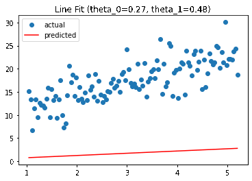
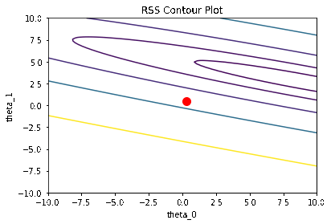
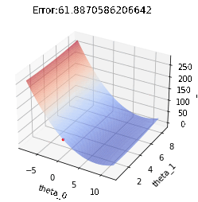
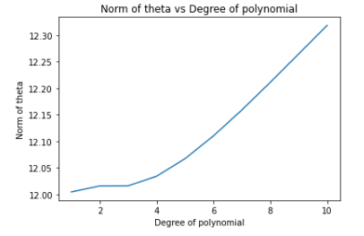
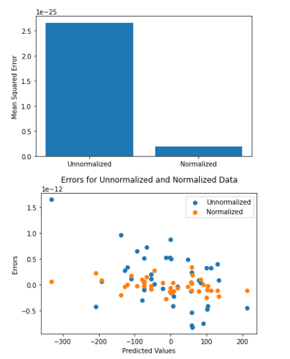
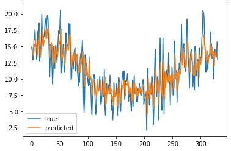

<h1>Assignment-4</h3>
<h2>Table of contents</h2>

- [Question-1](#question-1)
- [Following are the error obtain by each fit:](#following-are-the-error-obtain-by-each-fit)
  - [For sklearn LinearRegression :](#for-sklearn-linearregression-)
  - [For linear regression using normal equations :](#for-linear-regression-using-normal-equations-)
  - [For linear regression using SVD :](#for-linear-regression-using-svd-)
- [Time comparison of different fit:](#time-comparison-of-different-fit)
- [question-2](#question-2)
    - [Batch Gradient Descent with manual gradient computation for unregularized oabjective:](#batch-gradient-descent-with-manual-gradient-computation-for-unregularized-oabjective)
    - [Batch Gradient Descent with jax gradient computation for unregularized oabjective:](#batch-gradient-descent-with-jax-gradient-computation-for-unregularized-oabjective)
    - [Batch Gradient Descent with manual gradient computation for ridge regularized objective:](#batch-gradient-descent-with-manual-gradient-computation-for-ridge-regularized-objective)
    - [Batch Gradient Descent with jax gradient computation for ridge regularized oabjective:](#batch-gradient-descent-with-jax-gradient-computation-for-ridge-regularized-oabjective)
    - [Batch Gradient Descent with jax gradient computation for lasso regularized oabjective:](#batch-gradient-descent-with-jax-gradient-computation-for-lasso-regularized-oabjective)
  - [The hyperparameter tuned for SGD with momentum is:](#the-hyperparameter-tuned-for-sgd-with-momentum-is)
- [question-3](#question-3)
  - [following are the gif as asked in question:](#following-are-the-gif-as-asked-in-question)
    - [GIF for Line fit](#gif-for-line-fit)
    - [GIF for coutour plot](#gif-for-coutour-plot)
    - [Surface Plot](#surface-plot)
- [Question-4](#question-4)
- [Question-5](#question-5)
  - [Dataset](#dataset)
- [Question-6](#question-6)
- [Question-7](#question-7)
    - [References:](#references)
  
# Question-1
  formula for fit_normal_equations is:
  $$ (X^TX)^-1(X^TY) $$
  The formula for SVD is:
$$ usv_t = SVD(X) $$
$$ θ = V_t^T  diag(S^-1)  U^T  y $$

  # Following are the error obtain by each fit:
    
  ## For sklearn LinearRegression : 
  RMSE:  0.6207498618060853
  
  MAE:  0.5126346094502967

 ## For linear regression using normal equations : 

RMSE:  0.6207498618060854

MAE:  0.5126346094502968
## For linear regression using SVD : 

RMSE:  0.6207498618060854

MAE:  0.5126346094502968

# Time comparison of different fit:
Time taken for sklearn implementation of linear regression :  0.006241321563720703

Time taken for normal equations implementation of linear regression :  0.006470441818237305

Time taken for SVD implementation of linear regression :  0.0034284591674804688

# question-2

### Batch Gradient Descent with manual gradient computation for unregularized oabjective:
                          metrics

                          RMSE:0.843179583039083
                          MAE:0.6839744739236334
                          time: 0.05467367172241211
                          Error: 0.843179583039083

### Batch Gradient Descent with jax gradient computation for unregularized oabjective:
                         metrics
                         RMSE:  0.8431795832970431
                         MAE:  0.6839744785864528
                         time: 28.611953020095825
                         Error: 0.8431795832970431
### Batch Gradient Descent with manual gradient computation for ridge regularized objective:
                     
                         metrics
                         RMSE:  0.8593177139864142
                         MAE:  0.6983915516562595
                         time: 0.09577465057373047
                         Error: 0.8593177139864142
### Batch Gradient Descent with jax gradient computation for ridge regularized oabjective:
                        metrics
                        RMSE:  0.8593177022748555
                        MAE:  0.6983915464657946
                        time: 28.68404531478882
                        Error: 0.8593177022748555
### Batch Gradient Descent with jax gradient computation for lasso regularized oabjective:
                       metrics
                       RMSE:  0.9425217177858145
                       MAE:  0.7595294526114049
                       time: 28.955561876296997
                       Error: 0.9425217177858145

The hyperparameter tuned for SGD with momentum is:
---
    | learning rate| penalty_value| beta| Error |    Time|
0            0.050          0.010   0.2  1.601751  0.574929
1            0.050          0.001   0.2  1.609964  0.751090
2            0.050          0.200   0.2  1.458750  1.011198
3            0.050          0.100   0.2  1.528199  1.026773
4            0.050          0.500   0.2  1.303657  0.834252
..             ...            ...   ...       ...       ...
120          0.001          0.010   0.6  0.843600  0.561877
121          0.001          0.001   0.6  0.843634  0.614022
122          0.001          0.200   0.6  0.847193  0.548620
123          0.001          0.100   0.6  0.844517  0.562258
124          0.001          0.500   0.6  0.858310  0.558515

# question-3
## following are the gif as asked in question:

### GIF for Line fit



### GIF for coutour plot


### Surface Plot



Reference for gifs: [GIF maker](https://ezgif.com/maker)
# Question-4



The magnitude or length of the vector is represented by the norm of the coefficient vector, which might rise or decrease based on the direction and magnitude of the coefficient updates.

If the coefficient updates are continually in the same direction, the norm of the coefficient vector will rise. This can happen if the learning rate, which determines the amount of the updates, is set too high. In this instance, the algorithm may overshoot the error function's minimum and continue to move in the same direction, increasing the norm of the coefficient vector.

If, on the other hand, the direction of the updates to the coefficients varies, the norm of the coefficient vector decreases. This can occur when the learning rate is too low, or when the algorithm is towards the minimum of the error function and the updates become smaller and more erratic.

Minimizing the norm encourages the function to be less “complex”. Mathematically, we can see that both the L1 and L2 norms are measures of the magnitude of the weights: the sum of the absolute values in the case of the L1 norm, and the sum of squared values for the L2 norm. So larger weights give a larger norm. This means that, simply put, minimizing the norm encourages the weights to be small, which in turns gives “simpler” functions.

as conclusion ,as degree increases the norm of theta increases. This is due to overfitting, which is the reason why introduce penalty such as ```l1``` and ```l2``` to reduce this coefficients and thus reduce variance.

References:
https://towardsdatascience.com/visualizing-regularization-and-the-l1-and-l2-norms-d962aa769932

[SKlearn](https://github.com/scikit-learn/scikit-learn/tree/main/sklearn/preprocessing)

# Question-5

plot magnitude of  the norm of parameter vector, theta v/s degree for varying N, where N is the size of the data set (size of x, and thus y) as follows:


## Dataset

```python

def generate_data(N):
    np.random.seed(0)
    X = np.random.rand(N, 1)
    y = X.squeeze()**2 + 0.1*np.random.randn(N)
    return X, y
    # X = np.array([i*np.pi/180 for i in np.linspace(60,300,N)])
    # y = 3*X + 8 + np.random.normal(0,3,len(X))
    # X = X.reshape(X.shape[0], 1)
    # return X, y

degrees = [1, 3, 5, 7, 9]
# N_list = [i for i in range(10, 101, 10)]
N_list = [10000, 100000, 1000000]
```

With a lower sample size, the model may struggle to estimate the coefficients effectively, resulting in bigger variations in theta values as the degree increases.

As the degree of the polynomial is increased, the norm of theta may also increase, which leads function to be more complex. So larger weights give a larger norm. This means that, simply put, minimizing the norm encourages the weights to be small, which in turns gives “simpler” functions.

The model may be better able to estimate the coefficients and less sensitive to changes in the degree of the polynomial with a bigger sample size.

Even with a greater sample size, however, there is still a trade-off between the models complexity and its capacity to generalise to new data. The model may get increasingly sophisticated and overfit the data as the degree increases, resulting in poor performance on fresh data.

The connection between theta and the polynomial degree will vary depending on the dataset and the desired balance between complexity and generalization. Therefore, selecting the appropriate polynomial degree and sample size is crucial to achieving optimal performance when using new data.
# Question-6

The standard scalar is used to normalise the data and fit to give rmse less as compared to unnormalized data

the plot is as follow:



# Question-7

the plot is as follow :



$$Test RMSE: 2.258846962753222 $$

A statistical model is autoregressive if it predicts future values based on past values. For example, an autoregressive model might seek to predict a stock's future prices based on its past performance.
This type of analysis is used when there is a correlation between the time series values and their preceding and succeeding values.

Here the recent 30 days are trained and the next day is tested for.

### References:

https://www.investopedia.com/terms/a/autoregressive.asp#:~:text=our%20editorial%20policies-,What%20Is%20an%20Autoregressive%20Model%3F,based%20on%20its%20past%20performance.


